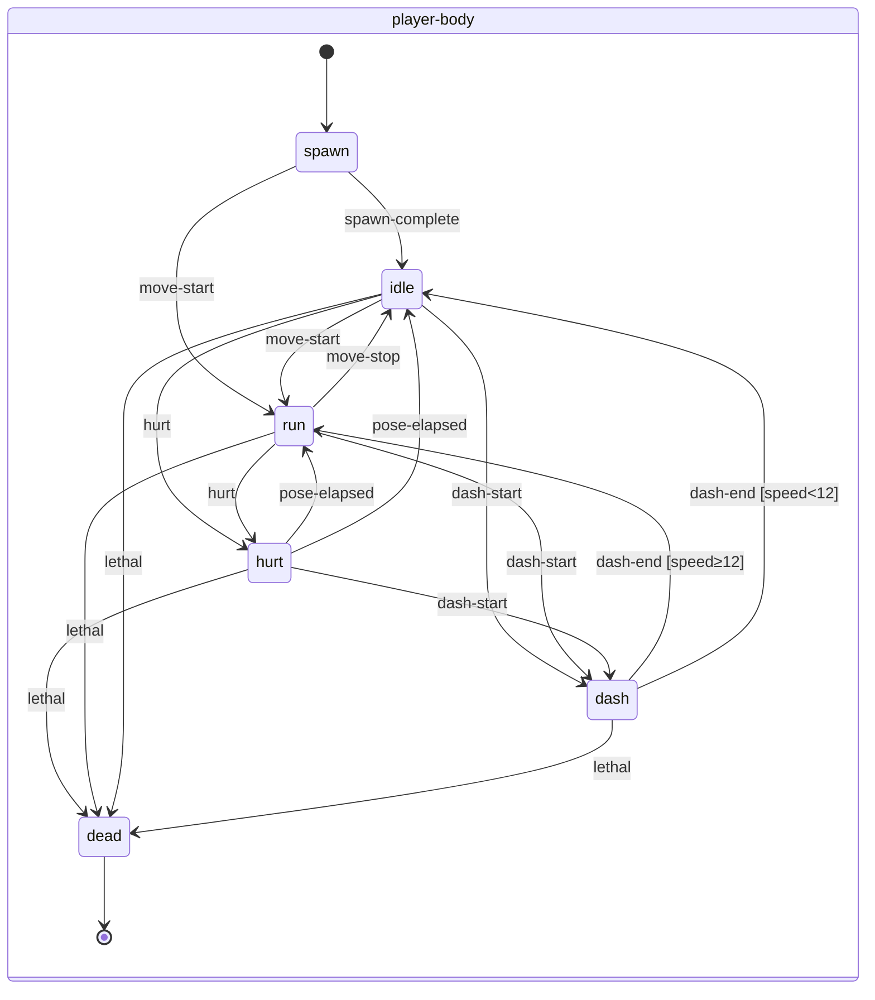
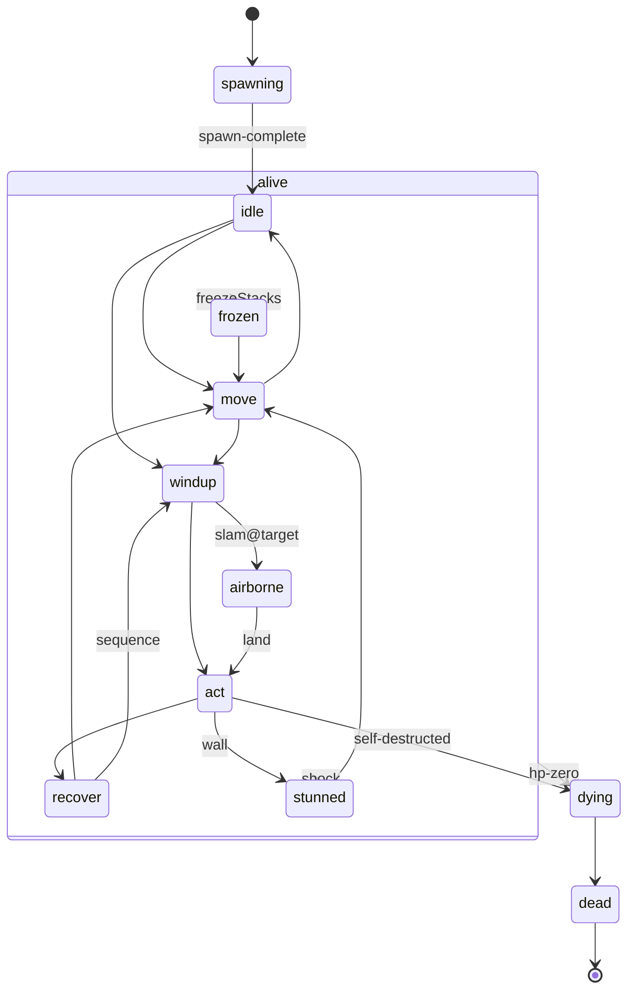

# Spellwright — `state-graph-spec`

**Owner:** Animator · **Status:** Wave 2, v1 · **Schema:** `gamestudio/.claude/skills/animation-state-graph-design/references/state-graph-spec-schema.md`
**Consumers:** Game Developer (`architecture.md` §10 animation wiring; `RunScene.timeControl`), Technical Artist (`animation-export` clip list, §1.3), 2D Artist (overlay slot requests, §6), Audio Director (markers live in `event-markers.md`).
**Siblings:** `telegraphs.md` (per-attack windup visuals, hit reactions, deaths) · `motion-spec.md` (UI and world-object motion) · `event-markers.md` (`hit-frame-data`).
**Inputs:** `feel-spec.md` (every `feel-tunables` name cited here is read from there, never restated), `mechanic-spec.md` §2/§9/§10, `data/enemies.json`, `data/bosses.json`, `asset-inventory.md` §2.1/§3, `architecture.md` §4/§9/§10.

---

## §0 How to read this spec (binding rules for every graph below)

**R1 — Two layers per actor.** Each actor is an authored frame clip (`phaser-frame-by-frame`) plus a **procedural layer** (offsets, flips, quantized scale, tint, overlay sprites, `TelegraphLayer` shapes). The downloaded art has only idle/run (plus one `hit` frame for the player), so the procedural layer carries anticipation, impact, stun, death and every telegraph. Each state below says exactly what both layers do.

**R2 — Visual states mirror the sim; they never drive it.** Enemy and boss graphs are a *projection* of the AI state machine (`mechanic-spec` §9.2: `move → windup → act → recover`). Transitions fire on `ai:enter-<state>` events emitted by the AI. The motion layer never delays, extends or cancels a gameplay state. Where a visual needs time the sim doesn't give it (death, corpse), it runs on a **visual-only** state after the sim entity has been released or marked dead.

**R3 — Sim-clock motion (the hit-stop rule).** Every gameplay-coupled motion must freeze during hit-stop and stretch under chill:
- **Telegraph visuals are computed each sim step from windup progress** `p = windupElapsedMs / windupTotalMs` (the AI's own timer, which already includes chill stretch, curse `windupMult` and the boss P3 `windupMult`). **No telegraph may be a fixed-duration tween.** If a 700 ms windup is chilled to 1 167 ms, the decal fills over 1 167 ms. If four 33 ms kill hit-stops land during it, the fill pauses four times. The lock/peak moment always coincides with the real aim lock.
- **Hit-stop freezes the whole presentation, not just physics.** `timeControl.hitstop(ms)` = `physics.world.pause()` **+** `this.tweens.pauseAll()` (RunScene's TweenManager) **+** `this.anims.pauseAll()` **+** `emitter.pause()` on every live RunScene particle emitter. Resume all four together. **Accepted and implemented:** `src/core/timecontrol.js` pauses the whole `run` scene for the stop, which freezes all four at once. Audio is not paused (feel-spec §handoffs). HUD scene tweens are not paused. Origin: objection O-ANIM-1 (§7), now resolved.
- Procedural offsets that are pure presentation (idle bob, pickup bob) may use RunScene tweens, since those pause with the rule above.

**R4 — Pixel integrity.** The game renders `pixelArt: true` with `roundPixels`, so nearest filtering at non-integer scale makes mixels.
- **Scale is quantized to 1/8 steps** (`0.75, 0.875, 1.0, 1.125, 1.25, 1.375`) and multiplied by the actor's **base scale** (1 for everyone, 2 for the Archlich per `art-slot-map` G2). On 16 px sprites every step lands on an integer bounding size, but nearest-neighbour still duplicates texels unevenly (mixels). So the real rule is the next bullet: **distortion is allowed only while it is the signal**. Tweens that animate scale apply `Math.round(s*8)/8` in `onUpdate` (or `ease: 'Stepped'`).
- **Non-1.0 scale is transient: ≤ 120 ms per squash/stretch pulse.** The only sustained non-1.0 scales are the ones tagged **[tell-scale]** in `telegraphs.md` §2 (imp fuse swell, brute charge crouch, Mire Queen leap crouch). Each lasts ≤ 1 s and *is* the telegraph. **Elites are ×1.0**: `rules.enemies.elite.scale` has been removed (mechanic-spec §9.4, O-ART-1 accepted). The elite marker is the **R10 elite treatment** (baked gold outline + gold ground ring), never scale. Sprites 32 px wide (bosses, Archlich at ×2) apply scale on the **x axis only** (36/46 px heights have no clean 1/8 step), and express rears and crouches with **integer y-offsets**.
- **No rotation of character sprites** except exact multiples of 90° (player death fall). Wands, weapons, decals and particles may rotate freely.
- Positional offsets are integer px.

**R5 — One tint channel, fixed priority.** A sprite has one tint and one tint mode, so the highest-priority active request wins each step:

| Priority | Request | Mode · token (style-guide §2.4) |
|---|---|---|
| 1 | dying flash / boss unravel strobe | `FILL` · `flash` (`#ffffff`) |
| 2 | hit flash (`enemyHitFlashMs`) | `FILL` · `flash` |
| 3 | frozen | `MULTIPLY` · `frost-tint` (`#8fd8ff`) |
| 4 | telegraph glow (windup, §R3 progress-driven) | `ADD` · `telegraph-hot`: ramps `#000000` → `#4a1526` across the signal, then **peak `#9f294e` in the lock window** |
| 5 | invulnerable (boss intro / phase-shift, spawn) | `MULTIPLY` · `invuln` (`#b8b8c8`) |
| 6 | chill (1 / 2 stacks) | `MULTIPLY` · `chill-tint-1` / `chill-tint-2` (`#cae6f5` / `#9fd0e8`) |
| 7 | locked door (props only) | `MULTIPLY` · `door-locked` (`#7a6a70`) |
| 8 | none | clear |

Tokens and hexes are from `style-guide.md` §2.4 (2D Artist). The dev maps the **names**; hexes here are for review only.

Burn, shock, poison, vulnerable, playerSlow and the elite outline are **overlay sprites or particles, never tint** (`art-slot-map` `status`), so they survive a windup. **Hit-flash re-arm:** after a flash ends, the next one can start only after `hitFlashRearmMs` (so the flash duty cycle is capped at 60 %), and a flash never overrides priority 4 during the **lock window** (the last `aimLockBeforeReleaseMs`). Without this, a 20-hits/s wand keeps an enemy permanently white and erases its telegraph peak. The `TelegraphLayer` decal is never affected by body tint.

**R6 — Facing.** `flipX` follows a direction vector's x with a deadband: flip only when `|dir.x| ≥ facingDeadband` (normalized), else keep the last facing. Player: `dir = aim`. Enemies: `dir = velocity` in `move`, `dir = toPlayer` in `windup`/`act`/`recover` (a charger faces its locked aim). Bosses use the same rule. Source art faces right.

**R7 — Anchors (pivot contract, for TA `animation-export` and dev).** Actor sprites use `origin (0.5, 1.0)`, i.e. the **feet** point. The actor's world position is its feet, and y-sort uses feet y (`architecture.md` §9 actor band). Named anchor offsets from feet (unflipped; mirror x when flipped):

| Actor class | Frame | `core` (flash/particle origin, hurtbox centre) | `hand` (held wand/weapon grip) | `head` (status icons, damage numbers) | `shadow` (ellipse w×h) |
|---|---|---|---|---|---|
| Player (wizzard 16×28, content y 7–28) | 16×28 | (0, −8) | (+4, −7) | (0, −21) | 10×3 |
| Small enemy 16×16 | 16×16 | (0, −6) | (+4, −5) | (0, −15) | 10×3 |
| Tall enemy 16×23 | 16×23 | (0, −8) | (+4, −8) | (0, −21) | 10×3 |
| Boss 32×36 (Knight, Queen) | 32×36 | (0, −14) | (+9, −14) | (0, −34) | 22×5 |
| Archlich (16×23 at base ×2) | 32×46 on screen | (0, −16) | (+8, −16) | (0, −44) | 22×5 |
| Flyer (any) | as above | as above, **plus bob offset** | — | as above | shadow stays on the ground; sprite floats +6 px above its feet anchor |

The player's hurtbox (`playerHurtboxRadius`) is centred on `core`, and the Arcade body (`playerBodyRadius`) on feet − (0, 4). The dev owns the final body offsets. This table is the visual contract they must match: bullets must visibly strike the robe, not the hat or the shadow.

**R8 — Reduced motion and photosensitivity** (UX `accessibility-spec.md` §4, binding): with reduced motion on, shakes are zeroed (feel-spec §0), squash/stretch pulses and jitter are disabled, and strobes become a steady tint. **Dash afterimages, hit particles and the cast kick are unchanged** (accessibility §4.1: actor-local feedback, not screen motion). I-frame flicker becomes alpha 1.0 ↔ 0.45. The boss intro pan becomes UX's cut (150 ms fade, hold, 150 ms fade back), and the boss rise keys on the fade-in completing instead of the pan arrival. **Telegraph decals, lock outlines and damage feedback are never removed**: they are information, not decoration. Always on: **no full-screen white flash anywhere** (§4.3), so every flash in the motion specs is sprite-local. **`flashIntensity` < 1:** the dev renders FILL-`flash` requests as `ADD` with tint `#ffffff × flashIntensity` (partial brighten), and as nothing at 0. The telegraph (ADD `telegraph-hot`) and the lock rim are not scaled.

**R10 — Elite treatment (mechanic-spec §9.4, style-guide §4.4).** Elites render at sprite scale **×1.0** with two markers. (1) A **baked 1 px `elite-gold` (`#facb3e`) outline**: the TA exports an elite variant of each candidate sheet, and it plays the same clips at the same rates. (2) A **gold ground ring**, an authored ellipse in `elite-gold` at α 0.5, drawn one depth step under the regular shadow at the feet anchor and sized to the actor class's shadow + 4 px (14×5 small/tall, 26×7 boss-class). It follows the feet with no bob (it stays grounded under flyers too) and is static: no pulse, so it never competes with telegraphs. Lifecycle: it fades in with the spawn portal (§3.2), stays through every alive state, and on death collapses to 0 width over `corpseCollapseMs` while the outline shatters (`telegraphs.md` §4.3). Elites use the same telegraphs and windups as normal enemies (mechanic §9.4). The outline is part of the sprite, so the R5 tint rules apply to it unchanged.

**R9 — Transition type.** Every runtime is frame-by-frame, so **every transition is `cut`** (schema: no `blend` for frame-by-frame). Continuity across a cut comes from the procedural layer: scale and offsets ease back to rest over the `on_entry` durations given, so no transition snaps a squash from 0.875 to 1.0 in one frame. Notation: a `from:` list (`from: [idle, move]`) is shorthand for one identical row per listed source, and `to:` is always a single state.

---

## §1 `motion-tunables` — the numbers this spec owns (dev reads verbatim)

Same row shape as `feel-tunables`, so `src/core/tunables.js` can parse both kinds of block with one reader. The orchestrator's rule applies: **every row must be read by code** (the `?debug` unread-tunables check covers this block too). Per-attack timings are *not* here, because they derive from `data/*.json` windups (§R3). Feel-spec values are referenced by name, never duplicated.

```yaml
motion-tunables:
  domain: actor-motion
  params:
    - { param: playerIdleFps, value: 6, unit: fps, source_ref: 0x72-idle-breath, range: [5, 8] }
    - { param: playerRunFps, value: 12, unit: fps, source_ref: 0x72-run-bounce, range: [10, 14] }
    - { param: runFpsSpeedScaleMin, value: 0.6, unit: ratio, source_ref: stride-match, range: [0.5, 1.0] }
    - { param: runEnterSpeed, value: 12, unit: px/s, source_ref: hysteresis, range: [8, 20] }
    - { param: runExitSpeed, value: 8, unit: px/s, source_ref: hysteresis, range: [4, 12] }
    - { param: facingDeadband, value: 0.15, unit: ratio, source_ref: flip-hysteresis, range: [0.05, 0.3] }
    - { param: hurtPoseMs, value: 100, unit: ms, source_ref: Hades-hurt-freeze, range: [66, 150] }
    - { param: dashStretchMs, value: 50, unit: ms, source_ref: Hades-dash, range: [33, 83] }
    - { param: dashAfterimageAlpha, value: 0.6, unit: ratio, source_ref: Hades-dash-trail, range: [0.3, 0.8] }
    - { param: castGlowPulseMs, value: 400, unit: ms, source_ref: Noita-wand-glow, range: [250, 700] }
    - { param: enemyIdleFps, value: 6, unit: fps, source_ref: 0x72-idle-breath, range: [4, 8] }
    - { param: enemyRunFps, value: 8, unit: fps, source_ref: 0x72-run-bounce, range: [6, 12] }
    - { param: flyerFlapFps, value: 10, unit: fps, source_ref: trashmobz-bat, range: [8, 14] }
    - { param: flyerBobPx, value: 2, unit: px, source_ref: hover-bob, range: [1, 3] }
    - { param: flyerBobPeriodMs, value: 1200, unit: ms, source_ref: hover-bob, range: [800, 1800] }
    - { param: spawnEmergeMs, value: 200, unit: ms, source_ref: EtG-spawn-portal, range: [120, 300] }
    - { param: telegraphOpeningMs, value: 100, unit: ms, source_ref: DS3-attack-anatomy, range: [66, 150] }
    - { param: telegraphJitterPx, value: 1, unit: px, source_ref: lock-tremble, range: [0, 1] }
    - { param: decalFillAlphaSignal, value: 0.18, unit: ratio, source_ref: style-guide-telegraph-fill, range: [0.1, 0.25] }
    - { param: decalFillAlphaLock, value: 0.35, unit: ratio, source_ref: style-guide-telegraph-fill, range: [0.25, 0.5] }
    - { param: releaseStretchMs, value: 66, unit: ms, source_ref: DS3-attack-anatomy, range: [33, 100] }
    - { param: hitSquashMs, value: 33, unit: ms, source_ref: NuclearThrone-hit-flash, range: [16, 50] }
    - { param: hitFlashRearmMs, value: 40, unit: ms, source_ref: flash-duty-cap, range: [16, 80] }
    - { param: corpseCollapseMs, value: 100, unit: ms, source_ref: NuclearThrone-corpse, range: [66, 150] }
    - { param: stunJitterHz, value: 20, unit: hz, source_ref: stun-tremble, range: [15, 30] }
    - { param: dizzyOrbitPeriodMs, value: 660, unit: ms, source_ref: cartoon-dizzy, range: [500, 900] }
    - { param: playerDeathFallMs, value: 300, unit: ms, source_ref: Isaac-death, range: [200, 450] }
    - { param: playerDeathDissolveMs, value: 400, unit: ms, source_ref: Isaac-death, range: [250, 600] }
    - { param: playerDeathHoldMs, value: 700, unit: ms, source_ref: Isaac-death, range: [400, 1200] }
    - { param: bossDeathHitstopMs, value: 200, unit: ms, source_ref: SmashBros-hitlag-heavy, range: [120, 300] }
    - { param: bossDeathUnravelMs, value: 1400, unit: ms, source_ref: EtG-boss-death, range: [900, 2000] }
    - { param: bossDeathBurstIntervalMs, value: 200, unit: ms, source_ref: EtG-boss-death, range: [120, 300] }
    - { param: bossPhaseShockwaveMs, value: 300, unit: ms, source_ref: EtG-boss-phase, range: [200, 450] }
    - { param: bossPhaseShockwaveRadiusPx, value: 120, unit: px, source_ref: EtG-boss-phase, range: [80, 180] }
    - { param: bossRisePx, value: 6, unit: px, source_ref: boss-intro-rise, range: [3, 10] }
```

---

## §2 Player — two parallel graphs

The player is one sprite (body) plus one held-wand sprite. Casting never changes the body clip (no cast frames exist; `asset-inventory` §3 gap 1). It is expressed by the wand graph, the cast kick and the `castMoveMult` run slowdown. Hence **two orthogonal graphs that run in parallel**: `player-body` and `player-wand`.

### 2.1 Clips (TA `animation-export` must emit these keys)

| Key | Source frames | Frames | Rate | Loop |
|---|---|---|---|---|
| `player_idle` | `wizzard_{m,f}_idle_anim_f0..3` (loadout skin) | 4 | `playerIdleFps` 6 → 667 ms cycle | yes |
| `player_run` | `wizzard_{m,f}_run_anim_f0..3` | 4 | `playerRunFps` 12 × speed scale → 333 ms cycle at full speed | yes |
| `player_dash` | `wizzard_*_run_anim_f2` (the airborne-high pose, content top y = 7) | 1 (held) | — | no |
| `player_hit` | `wizzard_*_hit_anim_f0` | 1 (held) | — | no |

**Run playback rate** = `playerRunFps × clamp(|v| / (moveSpeed × relic.moveSpeedMult), runFpsSpeedScaleMin, 1.0)`, set via `anims.timeScale` each step. That gives `castMoveMult` 0.9 a 10 % slower bounce (the "plant"), and pad half-stick walks slow the cycle to match the stride (no ice-skating).

**Contact frames** (measured from the alpha bbox of `wizzard_m_run`: content top y = 10 / 8 / 7 / 9 across f0..f3, so **f0 is the low/contact pose and f2 the high/airborne pose**). Footstep **SFX** fires on f0 and f2 (two steps per 333 ms cycle ≈ 6 steps/s, an apprentice's scurry at 18 px/step). Footstep **dust** fires on f0 only (every second step, per feel-spec §move polish). Markers: `event-markers.md` §1.

### 2.2 `player-body` graph

```yaml
graph:
  id: player-body
  description: Player body clip + procedural layer. Input never waits on this graph.
  runtime: phaser-frame-by-frame
  default_state: spawn

  states:
    - id: spawn
      description: Run start (Sanctum) and floor arrival only. Room-to-room entry uses the room fade, not this state.
      animation_key: player_idle
      loop: true
      interrupt_priority: medium
      on_entry:
        - procedural: "scaleY 0 → 1 from feet, Back.easeOut, 250 ms, quantized 1/8; alpha 0 → 1 over the first 120 ms"
        - fx: "portal_ring_cyan collapse frames f4..f9 at the feet (TA flipbook, 20 fps)"
        - input: "accepted; movement begins immediately (the materialize is cosmetic)"
      on_exit: [ "scale 1, alpha 1" ]

    - id: idle
      animation_key: player_idle
      loop: true
      interrupt_priority: low
      on_entry: [ "anims.timeScale = 1", "scale → 1.0 over 50 ms Quad.easeOut if not already 1" ]

    - id: run
      animation_key: player_run
      loop: true
      interrupt_priority: low
      on_entry:
        - "play from f0 (contact) so the first footstep lands on the input frame"
        - "anims.timeScale per §2.1 every step"

    - id: dash
      description: dashDurationMs of held airborne pose with stretch and afterimages.
      animation_key: player_dash
      loop: false
      interrupt_priority: high
      on_entry:
        - "flipX by dash dir.x (R6 deadband), not by aim, for the dash only"
        - "stretch: scaleX 1.25 / scaleY 0.75 at step 0, return to 1.0/1.0 over dashStretchMs, Quad.easeOut"
        - "afterimages: dashAfterimages (feel) ghost sprites at k·dashDurationMs/N (k = 0..N−1), frame = current dash frame, tint FILL `dash-ghost`, alpha dashAfterimageAlpha → 0 over dashAfterimageFadeMs (feel), Linear; depth actors−1; pooled"
        - "dust puff (TA fx) at the origin feet, oriented opposite dir"
        - "shadow stays at the feet (no hop): top-down dash is ground motion"
      on_exit: [ "flipX returns to aim facing (R6)" ]

    - id: hurt
      description: The damage-taken beat. Sim hit-stop freezes this pose (R3); then hold hurtPoseMs.
      animation_key: player_hit
      loop: false
      interrupt_priority: high
      on_entry:
        - "step 0: frame player_hit, tint FILL `flash` for 1 sim step, then FILL palette red `#da4e38` (proposed token `hurt-red`, 2D Artist to confirm) for 2 steps, then clear (the freeze makes these read as a held flash)"
        - "hit-stop hurtHitstopMs (feel) via timeControl (R3); red screen-edge flash hurtFlashMs (feel, UX layer)"
        - "after the hit-stop: squash scaleX 1.125 / scaleY 0.875 along knockback for hitSquashMs, then 1.0"
        - "i-frame flicker overlay starts (§2.4); lasts hurtIframesMs (feel), independent of this state"
      cancel_windows:
        - { frames: [0, 0], accepts: [dash, dead] }   # single held frame; dash cancels any time after the hit-stop

    - id: dead
      description: Visual-only death beat; the sim has already emitted `lethal` and stopped the player.
      animation_key: player_hit
      loop: false
      interrupt_priority: terminal
      terminal: true
      on_entry:
        - "hit-stop hurtHitstopMs (feel); white FILL for its duration"
        - "fall: rotation 0 → ±90° (sign = knockback x; exact 90° per R4) over playerDeathFallMs, Quad.easeIn; feet anchor fixed"
        - "on fall complete: heavy dust puff (the wand has already dropped: player-wand → hidden on `lethal`)"
        - "dissolve: alpha 1 → 0.66 → 0.33 → 0 (Stepped 3) over playerDeathDissolveMs while fx.soul_release plays from core"
        - "hold playerDeathHoldMs, then emit motion:player-death-done → sceneflow fades to run-end (motion-spec `screen-root-fade`)"
        - "enemies: AI stops issuing new windups on `lethal` (dev); in-flight projectiles continue and pass through"
```

**Transitions (exhaustive).** Events: `move-start` (|v| ≥ `runEnterSpeed`), `move-stop` (|v| < `runExitSpeed`), `dash-start`/`dash-end` (sim), `hurt` (HP damage landed), `shield-break` (shield absorbed), `lethal`, `lethal-revived` (a revive relic fired), `hurt-pose-elapsed` (hit-stop + `hurtPoseMs`), `spawn-complete` (250 ms).

```yaml
  transitions:
    - { from: spawn, to: idle, on: spawn-complete, condition: "speed < runEnterSpeed", type: cut }
    - { from: spawn, to: run,  on: spawn-complete, condition: "speed >= runEnterSpeed", type: cut }
    - { from: spawn, to: run,  on: move-start, type: cut }
    - { from: spawn, to: dash, on: dash-start, type: cut }
    - { from: idle, to: run,  on: move-start, type: cut }
    - { from: run,  to: idle, on: move-stop,  type: cut }
    - { from: idle, to: dash, on: dash-start, type: cut }
    - { from: run,  to: dash, on: dash-start, type: cut }
    - { from: dash, to: run,  on: dash-end, condition: "speed >= runEnterSpeed", type: cut }   # dashExitVelocityFrac·moveSpeed ≈ 38 px/s, so normally this branch
    - { from: dash, to: idle, on: dash-end, condition: "speed < runEnterSpeed", type: cut }    # dash into a wall: stopped dead
    - { from: idle, to: hurt, on: hurt, type: cut, transition_priority: high }
    - { from: run,  to: hurt, on: hurt, type: cut, transition_priority: high }
    - { from: spawn, to: hurt, on: hurt, type: cut, transition_priority: high }
    - { from: dash, on: hurt, ignore: true }            # unreachable: dashIframesMs (190) > dashDurationMs (150)
    - { from: hurt, on: hurt, ignore: true }            # unreachable: hurtIframesMs (1000) > the hurt pose (≤ 190)
    - { from: hurt, to: dash, on: dash-start, type: cut }
    - { from: hurt, to: run,  on: hurt-pose-elapsed, condition: "speed >= runEnterSpeed", type: cut }
    - { from: hurt, to: idle, on: hurt-pose-elapsed, condition: "speed < runEnterSpeed", type: cut }
    - { from: hurt, on: move-start, ignore: true }      # pose holds; knockback owns the first 100 ms
    - { from: hurt, on: move-stop, ignore: true }
    - { from: any, on: shield-break, ignore: true }     # body unchanged; shield shatter FX + shieldBreakHitstopMs + flicker overlay (§2.4)
    - { from: any, to: hurt, on: lethal-revived, type: cut, transition_priority: high }  # revive variant: FILL palette gold `#facb3e` instead of hurt-red, feather burst FX
    - { from: any, to: dead, on: lethal, type: cut, transition_priority: terminal }
```

Every state is reachable from `spawn`. Every non-terminal state has an exit to `idle`, and `dead` is the only terminal state. Move and stop events in `dash` are ignored implicitly (the dash owns velocity), and the dev may treat `(dash, move-*)` as `ignore`.

### 2.3 `player-wand` graph (held wand, parallel region)

**Geometry (binding).** The held wand is the slot map's **8×10 staff-head crop**. It uses origin `(0.5, 1.0)` (its butt end), is positioned at `core + aim × (wandTipOffsetPx − 10)` (= `core` at the feel value 10), and has `rotation = atan2(aim) + 90°` every step with no smoothing (feel §aim polish). Its **visible gem tip therefore lands exactly at `core + aim × wandTipOffsetPx`**, where shots and `fx.muzzle` spawn, whatever the facing. (A wand hung from an off-centre `hand` anchor would drift ±3 px from the spawn point as aim rotates.) It renders one depth step *behind* the body when `aim.y < −0.35` (pointing up/away) and in front otherwise. If a designer retunes `wandTipOffsetPx` within its range [6, 14], the formula keeps the tip on the spawn point.

```yaml
graph:
  id: player-wand
  runtime: phaser-frame-by-frame
  default_state: ready
  states:
    - id: ready
      animation_key: wand_held        # single frame; per-wand skin from art-slot-map
      loop: false
      interrupt_priority: low
      on_entry: [ "tip glow sprite (ADD band 61) alpha 0.35 steady" ]
    - id: firing
      description: Entered on every `wand:cast`; re-entering restarts it. Exits castKickMs after the last cast.
      animation_key: wand_held
      loop: false
      interrupt_priority: medium
      on_entry:
        - "muzzle flash (element hue) at the tip for muzzleFlashMs (feel)"
        - "kick: wand AND body offset −castKickPx along aim at step 0, return over castKickMs Quad.easeOut (integer px: the 1 px holds for 2 steps, then 0)"
        - "tip glow alpha → 1.0, then decays toward 0.6 while the trigger is held (sine pulse 0.6–1.0, period castGlowPulseMs)"
    - id: recharging
      animation_key: wand_held
      loop: false
      interrupt_priority: low
      on_entry: [ "tip glow alpha 0.15 (spent)", "HUD recharge bar per motion-spec `hud-wand-recharge`" ]
    - id: swap-lock
      description: wandSwapMs (feel) lockout after a swap. Timers carry (rules.casting.wandSwapCarriesTimers).
      animation_key: wand_held
      loop: false
      interrupt_priority: medium
      on_entry: [ "set the new wand skin", "wand FILL `flash` for 1 step (feel §cast: 1-frame flash)", "then MULTIPLY #808080 easing to none over wandSwapMs, Linear (timing-critical)" ]
    - id: hidden
      animation_key: wand_held
      loop: false
      interrupt_priority: terminal
      terminal: true
      on_entry: [ "detach; rotate to 90° (lying flat) and fall to the feet over 200 ms Quad.easeIn; lie there 1 s, then fade 200 ms (art-slot-map player_death)" ]
  transitions:
    - { from: ready,      to: firing,     on: wand-cast, type: cut }
    - { from: firing,     to: firing,     on: wand-cast, type: cut }          # restart kick; no queueing
    - { from: firing,     to: ready,      on: kick-elapsed, condition: "!deck.recharging", type: cut }
    - { from: firing,     to: recharging, on: recharge-start, type: cut }
    - { from: ready,      to: recharging, on: recharge-start, type: cut }     # editForcesRecharge after the editor closes
    - { from: recharging, to: ready,      on: recharge-end, type: cut }
    - { from: recharging, on: wand-cast, ignore: true }                      # impossible by the sim; listed for coverage
    - { from: [ready, firing, recharging], to: swap-lock, on: wand-swap, type: cut }
    - { from: swap-lock,  to: ready,      on: swap-lock-elapsed, condition: "!deck.recharging", type: cut }
    - { from: swap-lock,  to: recharging, on: swap-lock-elapsed, condition: "deck.recharging", type: cut }
    - { from: swap-lock,  to: swap-lock,  on: wand-swap, type: cut }          # rapid swaps restart the lock
    - { from: any,        on: sputter, ignore: true }                        # state unchanged: grey puff at the tip sputterFlashMs, rate-limited by sputterMinIntervalMs (feel)
    - { from: any,        on: dash-start, ignore: true }                     # wand keeps tracking aim; casting is blocked by the sim, not hidden
    - { from: any,        to: hidden,     on: lethal, type: cut, transition_priority: terminal }
```

### 2.4 Player overlays (flags, not states)

| Overlay | Trigger → end | Motion |
|---|---|---|
| I-frame flicker | `hurt`/`shield-break`/`lethal-revived` → `hurtIframesMs` (feel) | Body and wand visibility toggle every `hurtFlickerPeriodMs` (feel). Reduced motion: alpha 1.0 ↔ 0.45. Sprite ≈ 16×20 px at ×3 = 48×60 screen px, far below the WCAG 2.3.1 general-flash area, so this is safe at 7.6 Hz. |
| Dash i-frames | dash start → `dashIframesMs` | No extra visual (afterimages carry it). Flicker is **not** used, to keep "dash" and "hurt" reads distinct. |
| Player slow | `playerSlow` active | Frost particle (2 px cyan motes, 1 per 150 ms falling from `core`) plus run fps × (1 − slowFrac) via the §2.1 formula (automatic, since speed drops). No tint (R5 reserves tint for damage reads). |
| Shield | shield charge > 0 | `8_protectioncircle` loop (TA, decimated) at `core`, alpha 0.35. On break: shatter flipbook + 6 shard particles, `shield_break` cue. |
| Low HP | HP ≤ 2 | No body motion (the HUD heart pulse and vignette own it: motion-spec `hud-low-hp`). |

---

## §3 Enemy archetypes — one shared graph, per-actor clip bindings

### 3.1 Clip classes (bind from the 2D Artist's `art-slot-map.json`)

The shared graph asks each actor for at most two clips, `<actor>_idle` and `<actor>_move`. Sheet shapes in the inventory fall into four classes. Each class says how the procedural layer fills the gap:

| Class | Source shape | `_idle` | `_move` | Procedural fill |
|---|---|---|---|---|
| **A** idle 4 + run 4 | 0x72 `skelet`, `imp`, `masked_orc`, `orc_shaman`, `chort`, `goblin`… | idle f0..3 @ `enemyIdleFps` | run f0..3 @ `enemyRunFps` × speed scale | none needed for locomotion |
| **B** single loop 4 | 0x72 `necromancer_anim`, `swampy_anim`, `muddy_anim`, `zombie_anim` | loop @ `enemyIdleFps` | the same loop @ `enemyRunFps` | move = faster loop plus a 1 px hop on f0/f2 (y −1 for one step) |
| **C** 2-frame | trashmobz bat (2 f) | row "down" 2 f @ `flyerFlapFps` | same | flyers: bob (`flyerBobPx`, `flyerBobPeriodMs`, Sine.easeInOut) |
| **D** static 1 frame | 0x72 `skull`, authored `eye_turret` | frame 0 | frame 0 | idle: bob (flyers) or breath (ground: scaleY 1.0 ↔ 0.9375 pulse via y-offset 1 px at 0.8 Hz); move: 1 px y chatter at 8 Hz |

**Speed scale for `_move`** = `clamp(|v| / data.speed, 0.6, 1.25)` (knockback slides do not speed the cycle past ×1.25).

**Bindings (from `art-slot-map.json` G1/G2, 2D Artist, Wave 2; the TA exports `<id>_idle` / `<id>_move` from these):**

| Enemy | Source (slot map) | Class | Frame | Signature procedural motion |
|---|---|---|---|---|
| `bat` | trashmobz bat cells (4,0)(5,0), L_BAT | C (flyer) | 16×16 | flap 10 fps + bob; swarm wobble is AI motion |
| `skeleton` | 0x72 `skelet_idle/run` | A | 16×16 | — |
| `cultist` | 0x72 `doc_idle/run`, L_CULTIST | A | 16×23 | — |
| `frost_mage` | 0x72 `orc_shaman_idle/run`, L_FROSTMAGE | A | 16×23 | 1 frost mote per 400 ms |
| `brute` | 0x72 `masked_orc_idle/run` | A | 16×23 | — |
| `slime` | 0x72 `swampy_anim` | B | 16×16 | move = hop on f0/f2 |
| `slimelet` | authored `slimelet_f0/f1` (2 f) | B | 9×8 | loop @ `enemyRunFps` + 10 (quick jiggle: 18 fps moving, 12 fps idle) |
| `fire_imp` | 0x72 `imp_idle/run` | A | 16×16 | 1 ember per 300 ms |
| `eye_turret` | authored `eye_turret_f0` (idle) + `eye_turret_f1` (**glare, shown for the whole windup**) | D | 16×16 | idle **eye blink**: scaleY 1 → 0.25 → 1 over 120 ms (Stepped 3) every 2.5–4 s (fx stream). Windup: the swap to f1 on step 0 is the silhouette change |
| `wraith` | 0x72 `angel_idle/run`, L_WRAITH, alpha 0.85 | A (flyer) | 16×16 | bob 2 px / 1 200 ms; alpha shimmer 0.8 ↔ 0.9 over 2 s Sine |
| `necromancer` | 0x72 `necromancer_anim` | B | 16×23 | — |
| `skull` | 0x72 `skull` + ADD `glow_16` trail #9f294e α 0.35 | D (flyer) | 16×16 | chatter 1 px at 8 Hz while moving |
| `stone_golem` | 0x72 `big_demon_idle/run`, L_GOLEM | A | 32×36 | idle at `enemyIdleFps` × 0.75 (heavier breath); boss-class anchors (R7) |

Bosses (G2): **Knight** = `big_zombie` (L_KNIGHT) + `boss_knight_blade` overlay (0x72 `weapon_knight_sword`) · **Queen** = `ogre` · **Archlich** = `necromancer_anim` at base ×2 (L_LICH) + `boss_lich_staff` overlay (staff top 16 rows, ×2). All class A except the Archlich (class B, the single loop, at base ×2).

### 3.2 `enemy` graph (every non-boss enemy)

```yaml
graph:
  id: enemy
  description: Projection of the mechanic-spec §9.2 AI state machine plus visual-only spawning/dying/corpse. Transitions key off ai:enter-* events.
  runtime: phaser-frame-by-frame
  default_state: spawning

  composite_states:
    - id: alive
      children: [idle, move, windup, airborne, act, recover, stunned, frozen]
      default_child: idle
      inherited_transitions:
        - { to: dying, on: hp-zero, type: cut, transition_priority: terminal }
        - { to: dying, on: summoner-died, type: cut, transition_priority: terminal }   # skulls, and any boss adds
        - { to: frozen, on: ai-enter-frozen, type: cut, transition_priority: high }     # chill reached freezeStacks
        - { to: stunned, on: ai-enter-stunned, type: cut, transition_priority: high }   # shock stun or charge wall-stun

  states:
    - id: spawning
      description: spawnPortalMs (rules, 700) inert and invulnerable. Visual only (the sim holds the entity inert).
      animation_key: <actor>_idle
      loop: true
      interrupt_priority: terminal     # nothing interrupts a spawn; the sim guarantees invulnerability
      on_entry:
        - "sprite hidden; portal flipbook (`fx.spawn_portal`, hostile LUT) at the feet; for elites the gold ground ring (R10) fades in under the portal over its first 200 ms, marking the elite before it emerges: f0..3 spin loop @ 12 fps until spawnPortalMs − spawnEmergeMs"
        - "at spawnPortalMs − spawnEmergeMs: sprite visible, scaleY 0 → 1 from feet, Back.easeOut, spawnEmergeMs, quantized; portal plays collapse f4..f7 @ 20 fps then sparkle f8..f9"
        - "tint MULTIPLY invuln until spawn end"
    - id: idle
      animation_key: <actor>_idle
      loop: true
      interrupt_priority: low
      on_entry: [ "scale/offset → rest over 50 ms Quad.easeOut" ]
    - id: move
      animation_key: <actor>_move
      loop: true
      interrupt_priority: low
      on_entry: [ "timeScale per §3.1 speed scale; facing per R6 (velocity)" ]
    - id: windup
      description: The telegraph. Everything is a function of progress p (R3). Per-type visuals in telegraphs.md §2.
      animation_key: <actor>_idle
      loop: true
      interrupt_priority: medium        # damage never interrupts (mechanic §9.2); stun/freeze/death do
      on_entry:
        - "anims.timeScale = 1.5 (the body 'revs up'), then 0 during the lock window (held pose = committed)"
        - "phases: opening [0, telegraphOpeningMs) · signal [opening, W − lock) · lock [W − aimLockBeforeReleaseMs, W) — see telegraphs.md §1"
        - "enemy_windup cue (per attack type) at step 0 (event-markers.md §3)"
    - id: airborne
      description: slam with at = target only. The body is untargetable for travelMs.
      animation_key: <actor>_idle
      loop: false
      interrupt_priority: high
      on_entry: [ "leap arc per telegraphs.md §2 `slam-target`" ]
    - id: act
      description: Release. Instant (swipe, shoot, ring, blink, summon, self-destruct) or sustained (charge durationMs, spiral shotsPerArm·intervalMs).
      animation_key: <actor>_move        # charge uses the move cycle at ×1.25; others hold the idle frame
      loop: true
      interrupt_priority: high
      on_entry:
        - "release stretch: +1/8 scale along the aim axis (scaleX 1.125 if |aim.x| ≥ |aim.y| else scaleY 1.125) for releaseStretchMs, then rest"
        - "telegraph decal → release flash (telegraphs.md §1.4) then removed"
    - id: recover
      description: The punish window (no movement, no new attack).
      animation_key: <actor>_idle
      loop: true
      interrupt_priority: low
      on_entry: [ "anims.timeScale = 0.5 (winded)", "offset −1 px y for the first 100 ms (slump), then 0" ]
    - id: stunned
      description: Shock stun (stunMs 250) or charge wall-stun (wallStunMs). Variant chosen by cause.
      animation_key: <actor>_idle
      loop: false
      interrupt_priority: medium
      on_entry:
        - "anims paused; ±telegraphJitterPx x jitter at stunJitterHz (shock variant), yellow spark overlay 3 motes"
        - "wall variant: impact squash toward the wall (scale on the hit axis 0.75 for 83 ms), heavyImpactShakePx/heavyImpactShakeMs (feel), dust burst; then the dizzy overlay: 3 star motes orbiting head at dizzyOrbitPeriodMs"
    - id: frozen
      description: freezeMs (rules) immobile, encased.
      animation_key: <actor>_idle
      loop: false
      interrupt_priority: medium
      on_entry: [ "anims paused on the current frame", "tint MULTIPLY frost-tint", "ice-shell overlay sprite (2D Artist) scaled to the actor class", "entry: 1-step FILL `flash` crack-in" ]
      on_exit: [ "thaw: ice shell shatter flipbook (simplefx ice cloud burst r5 c1–4) + 4 shard particles, `freeze_shatter` cue" ]
    - id: dying
      description: Visual-only. The sim entity is dead at entry (no hits, no contact). Per-class variants in telegraphs.md §4.
      animation_key: <actor>_idle
      loop: false
      interrupt_priority: terminal
      on_entry: [ "see telegraphs.md §4 (flash through the hit-stop, collapse, puff, corpse fade)" ]
    - id: dead
      description: Released to the pool.
      animation_key: <actor>_idle
      loop: false
      interrupt_priority: terminal
      terminal: true

  transitions:
    - { from: spawning, to: idle, on: spawn-complete, type: cut }
    - { from: spawning, on: hp-zero, ignore: true }                      # invulnerable while spawning
    - { from: idle,     to: move,     on: ai-enter-move, type: cut }
    - { from: move,     to: idle,     on: ai-enter-idle, type: cut }     # stationary turrets, stopRange reached, kiter hold
    - { from: [idle, move], to: windup, on: ai-enter-windup, type: cut }
    - { from: windup,   to: act,      on: ai-enter-act, type: cut }
    - { from: windup,   to: airborne, on: ai-enter-airborne, type: cut } # slam at = target
    - { from: airborne, to: act,      on: ai-enter-act, type: cut }      # landing
    - { from: act,      to: recover,  on: ai-enter-recover, type: cut }
    - { from: act,      to: dying,    on: self-destructed, type: cut, transition_priority: terminal }  # imp: explodes, no corpse variant
    - { from: recover,  to: move,     on: ai-enter-move, type: cut }
    - { from: recover,  to: idle,     on: ai-enter-idle, type: cut }
    - { from: recover,  to: windup,   on: ai-enter-windup, type: cut }   # sequence steps, and cooldown 0
    - { from: stunned,  to: move,     on: ai-enter-move, type: cut }
    - { from: stunned,  to: idle,     on: ai-enter-idle, type: cut }
    - { from: frozen,   to: move,     on: ai-enter-move, type: cut }
    - { from: frozen,   to: idle,     on: ai-enter-idle, type: cut }
    - { from: act,      to: stunned,  on: ai-enter-stunned, type: cut }  # charge → wall; also a shock during a sustained act if the sim allows it
    - { from: airborne, on: ai-enter-stunned, ignore: true }             # untargetable in travel (mechanic §9.3)
    - { from: airborne, on: ai-enter-frozen,  ignore: true }
    - { from: [windup, act, recover, idle, move, stunned, frozen], on: hit, ignore: true }  # damage never changes state; hit reaction is an overlay (telegraphs.md §3)
    - { from: dying,    to: dead,     on: death-visual-complete, type: cut }
```

**Coverage check.** `spawning → idle` is the only entry. Every `alive` child reaches `dying` via the inherited transitions. `dying → dead` is terminal. `hit` is an overlay event on every state (never a state). Stun/freeze during `windup` inherit to `stunned`/`frozen`: the telegraph decal is **removed with a 100 ms fade-out and a grey "fizzle" puff** (telegraphs.md §1.5), so an interrupted attack never leaves a live-looking decal. The imp is special: `hp-zero` during `windup` (flag `explodeIfKilledDuringWindup`) goes to `dying` with the **detonate** variant.

---

## §4 Bosses — `boss` graph (extends `enemy`)

Boss clips are idle 4 / run 4 (32×36, class A). No attack frames exist (`asset-inventory` §3 row 2b), so tells come from overlays (§6), tint, offsets and `TelegraphLayer` shapes.

```yaml
graph:
  id: boss
  description: enemy graph + intro, phase-shift and boss death. Bosses are immune to stun/freeze; charge wall-stun still applies.
  runtime: phaser-frame-by-frame
  default_state: intro

  composite_states:
    - id: alive
      children: [idle, move, windup, airborne, act, recover, stunned]
      default_child: idle
      inherited_transitions:
        - { to: phase-shift, on: phase-enter, type: cut, transition_priority: high }   # aborts the current attack (mechanic §10)
        - { to: dying, on: hp-zero, type: cut, transition_priority: terminal }

  states:
    - id: intro
      description: bossActivateDelayMs (rules, 1200) inert and invulnerable. The camera pans bossIntroPanMs (feel).
      animation_key: <boss>_idle
      loop: true
      interrupt_priority: terminal
      on_entry:
        - "0 ms: sprite at spawn, anims paused on f0, tint MULTIPLY invuln, y-offset +bossRisePx (crouched low)"
        - "on camera-pan arrival (bossIntroPanMs/2): rise: y-offset +bossRisePx → 0, Back.easeOut 300 ms (integer px; no scaleY on 36 px sprites, R4); anims resume; `boss_intro` cue (proposed); name card (motion-spec `boss-name-card`)"
        - "last 150 ms: 1-step FILL `flash`, tint clears: the 'awake' read"
    - id: phase-shift
      description: invulnMs from onEnter (1200 / 1500). Power-up beat. Pattern restarts at pattern[0] after it.
      animation_key: <boss>_idle
      loop: true
      interrupt_priority: high
      on_entry:
        - "step 0: bossPhaseHitstopMs (feel) via timeControl; FILL flash held through the stop; fx.phase_burst from core (sprite-local, no full-screen flash, per accessibility-spec §4.3); `boss_phase` cue"
        - "after the stop: shockwave ring (TelegraphLayer) radius 0 → bossPhaseShockwaveRadiusPx over bossPhaseShockwaveMs, Cubic.easeOut, alpha 1 → 0, same step as the shockwaveKnockback impulse; enemy projectiles clear with a 1-step pop each"
        - "hold: tint MULTIPLY invuln, x jitter ±1 px at stunJitterHz, 3 aura pulses (ADD #5a3a8a 0 → peak → 0, Sine, evenly across invulnMs − 300)"
        - "last 300 ms: roar pose: y −2 px and scaleX 0.9375 (1/16 step → 30 px), then snap back to rest at state exit (a release beat)"
        - "hits during phase-shift: grey 'clink' spark, no flash, no damage number (the invulnerability read)"
    - { id: idle,    animation_key: <boss>_idle, loop: true,  interrupt_priority: low }
    - { id: move,    animation_key: <boss>_move, loop: true,  interrupt_priority: low }
    - { id: windup,  animation_key: <boss>_idle, loop: true,  interrupt_priority: medium }
    - { id: airborne,animation_key: <boss>_idle, loop: false, interrupt_priority: high }
    - { id: act,     animation_key: <boss>_move, loop: true,  interrupt_priority: high }
    - { id: recover, animation_key: <boss>_idle, loop: true,  interrupt_priority: low }
    - { id: stunned, animation_key: <boss>_idle, loop: false, interrupt_priority: medium }   # charge wall-stun only (dizzy variant)
    - id: dying
      animation_key: <boss>_idle
      loop: false
      interrupt_priority: terminal
      on_entry: [ "boss death sequence, telegraphs.md §4.4 (bossDeathHitstopMs → unravel → final burst)" ]
    - { id: dead, animation_key: <boss>_idle, loop: false, interrupt_priority: terminal, terminal: true }

  transitions:
    - { from: intro,       to: idle,     on: boss-activate, type: cut }
    - { from: intro,       on: hp-zero,  ignore: true }                 # invulnerable
    - { from: intro,       on: phase-enter, ignore: true }
    - { from: phase-shift, to: idle,     on: phase-shift-elapsed, type: cut }
    - { from: phase-shift, on: phase-enter, ignore: true }              # damage is clamped at thresholds; one phase per shift
    - { from: phase-shift, on: hp-zero,  ignore: true }                 # invulnerable
    - { from: idle,     to: move,     on: ai-enter-move, type: cut }
    - { from: move,     to: idle,     on: ai-enter-idle, type: cut }
    - { from: [idle, move], to: windup, on: ai-enter-windup, type: cut }  # includes approachMs close-in finishing (cleave)
    - { from: windup,   to: act,      on: ai-enter-act, type: cut }
    - { from: windup,   to: airborne, on: ai-enter-airborne, type: cut }
    - { from: airborne, to: act,      on: ai-enter-act, type: cut }
    - { from: act,      to: recover,  on: ai-enter-recover, type: cut }
    - { from: act,      to: stunned,  on: ai-enter-stunned, type: cut } # charge into a wall/pillar
    - { from: recover,  to: move,     on: ai-enter-move, type: cut }
    - { from: recover,  to: idle,     on: ai-enter-idle, type: cut }
    - { from: recover,  to: windup,   on: ai-enter-windup, type: cut }  # sequence step 2 (double_leap gapMs spent in recover)
    - { from: stunned,  to: move,     on: ai-enter-move, type: cut }
    - { from: stunned,  to: idle,     on: ai-enter-idle, type: cut }
    - { from: alive,    on: hit, ignore: true }                          # overlay only (telegraphs.md §3.3)
    - { from: dying,    to: dead, on: death-visual-complete, type: cut }
```

`sequence` attacks (`double_leap`) run `windup → airborne → act → recover(gapMs) → windup → …`. The graph needs no special state. `recover` is entered with the gap duration and the dev emits `ai-enter-windup` for step 2.

---

## §5 Diagrams (human review; must agree with the YAML)





(Boss: `intro → alive`; `alive → phase-shift → idle`; no `frozen`. The shock `stunned` edge is removed and only the wall-stun edge remains.)

---

## §6 Overlay sprite requests: status

All requests were **resolved by the 2D Artist in `art-slot-map.json`**:

| Request | Resolution (slot map) |
|---|---|
| `wand_held` (≤ 10 px, tip at `wandTipOffsetPx`) | ✔ `wands.<id>.held`: 0x72 staff **top 10 rows crop, 8×10**, gem LUT per wand. The inventory's 8×30 staff is kept only for `wand_drop` pedestals. |
| `boss_knight_blade` | ✔ 0x72 `weapon_knight_sword` |
| `boss_lich_staff` | ✔ 0x72 `weapon_red_magic_staff`, top 16 rows, ×2, L_GEM_VIOLET |
| `ice_shell_16` | ✔ `status.frozen.overlay` (simplefx rect, α 0.7, covers the lower 16 px). 32 px actors are boss-class and immune to freeze, so no `ice_shell_32` is needed. |
| status pips | ✔ `status.*` (burn simplefx flames at `head`, poison drips + numeral, shock DevWizard sparks at `core`, vulnerable "!" glyph) |
| shadows | ✔ authored `shadow_10x3` / `shadow_22x5` |

FX ids used across the motion specs are the slot map's `fx.*` names (`fx.enemy_slash`, `fx.cast_glyph`, `fx.summon_sigil`, `fx.spawn_portal`, `fx.blink_puff`, `fx.phase_burst`, `fx.soul_release`, `fx.freeze_shatter`, `fx.explosion`, `fx.hit_ring`, `fx.muzzle`, `fx.sputter_puff`, `fx.poison_burst`).

---

## §7 Hand-off: objections raised by this spec (both resolved)

| Id | Against | Summary | Proposed alternative |
|---|---|---|---|
| **O-ANIM-1** ✔ accepted (`src/core/timecontrol.js` pauses the `run` scene) | `architecture.md` §4 time control (Game Developer) | Hit-stop pauses only `physics.world`. Sprite anims, RunScene tweens and particle emitters keep running, so the hit-stop "freeze frame" (Vlambeer) never reads, and any tween-driven telegraph drifts ahead of the real release. | `timeControl.hitstop(ms)` also pauses the RunScene TweenManager, the AnimationManager and the live RunScene emitters, and resumes them together (R3). Telegraphs are driven from the AI windup progress (R3), never from tweens. |
| **O-ANIM-2** ✔ accepted (glint 2.5 s, random phase) | `hud-layout.md` §6 pedestal sparkle "every 1.5 s" (UX Designer) | A T3 pickup glint more often than once per 2 s over-draws attention against T2 hazards and breaks the `object-and-environmental-animation` DOG (glint ≤ 1 per 2–4 s). | Glint every **2.5 s**, randomly phased per pedestal (motion-spec `world-pickup-bob`). The reduced-motion static glint pixel is unchanged. |

Resolved without objection: the held-wand geometry (2D Artist adopted the 8×10 crop), elite scale (O-ART-1 accepted by the Game Designer: `elite.scale` removed, elites ×1.0 + gold marker), crit number scale (Animator concurs with UX O-UX-3: integer ×2), telegraph colours (style-guide §2.4 tokens adopted).
